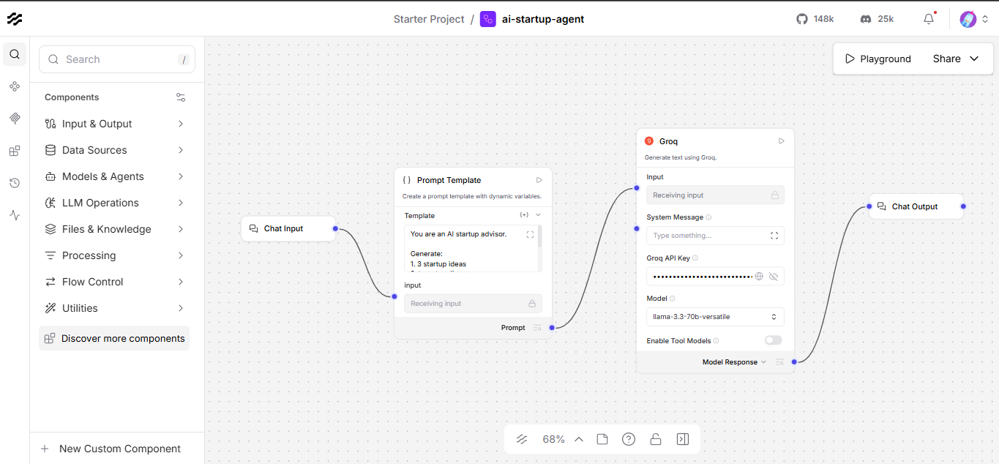
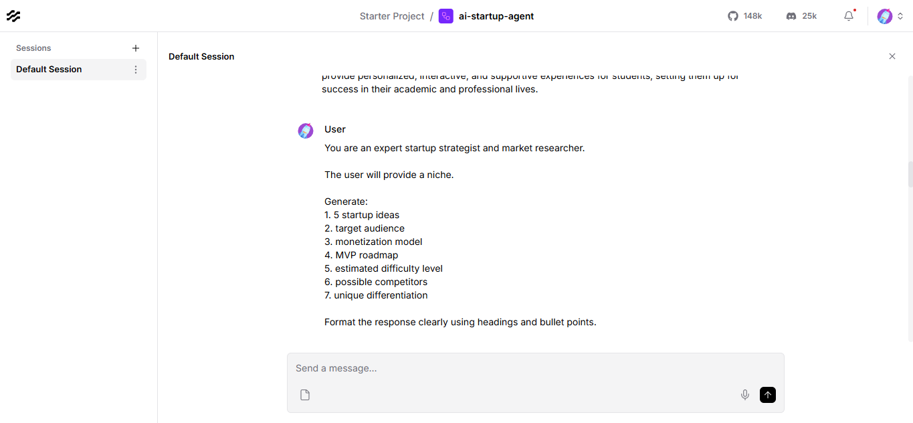
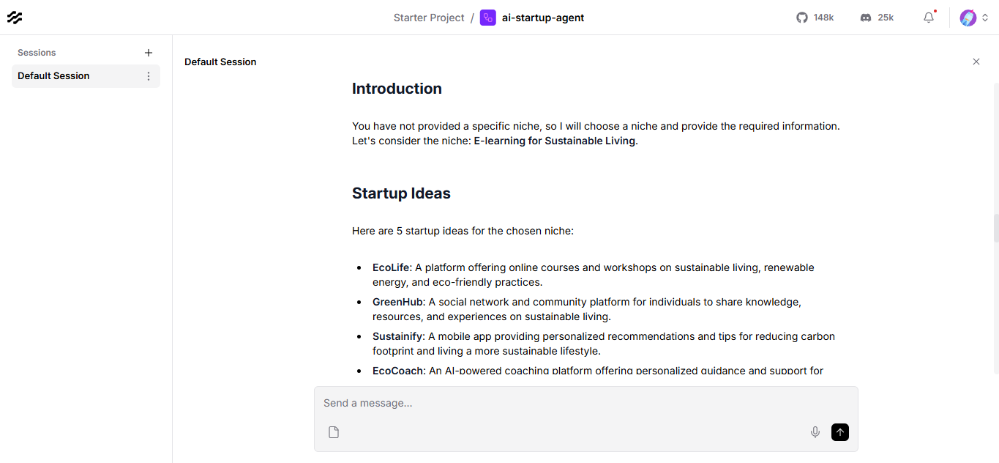

<div align="center">

<br/>

<!-- ASCII/Text hero — swap for a banner image if you create one -->
```
  █████╗ ██╗    ███████╗████████╗ █████╗ ██████╗ ████████╗██╗   ██╗██████╗
 ██╔══██╗██║    ██╔════╝╚══██╔══╝██╔══██╗██╔══██╗╚══██╔══╝██║   ██║██╔══██╗
 ███████║██║    ███████╗   ██║   ███████║██████╔╝   ██║   ██║   ██║██████╔╝
 ██╔══██║██║    ╚════██║   ██║   ██╔══██║██╔══██╗   ██║   ██║   ██║██╔═══╝
 ██║  ██║██║    ███████║   ██║   ██║  ██║██║  ██║   ██║   ╚██████╔╝██║
 ╚═╝  ╚═╝╚═╝   ╚══════╝   ╚═╝   ╚═╝  ╚═╝╚═╝  ╚═╝   ╚═╝    ╚═════╝ ╚═╝
                        ██████╗ ███████╗███╗   ██╗████████╗
                       ██╔══██╗██╔════╝████╗  ██║╚══██╔══╝
                       ███████║█████╗  ██╔██╗ ██║   ██║
                       ██╔══██║██╔══╝  ██║╚██╗██║   ██║
                       ██║  ██║███████╗██║ ╚████║   ██║
                       ╚═╝  ╚═╝╚══════╝╚═╝  ╚═══╝   ╚═╝
```

# AI Startup Agent

### *From idea to insights — in seconds.*

<br/>

[](https://python.org)
[](https://langflow.org)
[](https://groq.com)
[](https://llama.meta.com)
[](LICENSE)
[](https://github.com/pun33th45/ai-startup-agent/stargazers)

<br/>

> **An AI-powered startup intelligence engine** — enter any niche and get structured startup ideas, audience analysis, monetization blueprints, MVP roadmaps, and competitive intelligence. Instantly.

<br/>

[**Live Demo**](#-screenshots) · [**Quick Start**](#-installation) · [**Architecture**](#-architecture--workflow) · [**Contribute**](#-contributing)

---

</div>

<br/>

## What is AI Startup Agent?

**AI Startup Agent** is a production-grade AI workflow system that transforms a simple topic or niche into a full startup intelligence report — in seconds. Built on **Langflow's** visual orchestration engine and powered by **Groq's** blazing-fast inference of **Meta's Llama 3**, it removes the research bottleneck from the early stages of building a company.

No hallucination loops. No vague output. Just structured, actionable intelligence.

<br/>

---

## Features

| | Feature | Description |
|---|---|---|
| **💡** | **Startup Idea Generation** | Context-aware ideas tailored to the entered niche |
| **🎯** | **Target Audience Profiling** | Demographic and psychographic breakdown |
| **💰** | **Monetization Strategy** | SaaS, marketplace, freemium, and more — ranked by fit |
| **🗺️** | **MVP Roadmap** | Phased milestones from concept to first paying user |
| **📊** | **Market Insights** | TAM, SAM, SOM analysis with trend signals |
| **🔍** | **Competitor Analysis** | Key players, positioning gaps, and white-space opportunities |
| **⚡** | **Sub-second Response** | Groq's LPU inference — 10–20× faster than typical LLM APIs |
| **🧩** | **Visual Workflow** | No-code Langflow canvas for easy modification |

<br/>

---

## Architecture & Workflow

```
┌─────────────────────────────────────────────────────────────────────┐
│                       AI STARTUP AGENT PIPELINE                      │
├─────────────────────────────────────────────────────────────────────┤
│                                                                       │
│   User Input          Prompt Template         Groq LLM               │
│  ┌──────────┐        ┌──────────────┐       ┌──────────┐            │
│  │  Niche / │──────▶ │  Structured  │──────▶│ Llama 3  │            │
│  │  Topic   │        │  Prompt w/   │       │ (via     │            │
│  │          │        │  Context     │       │  Groq)   │            │
│  └──────────┘        └──────────────┘       └────┬─────┘            │
│                                                   │                  │
│                                                   ▼                  │
│              ┌────────────────────────────────────────────┐         │
│              │              Structured Output              │         │
│              ├────────────┬───────────┬────────────────────┤         │
│              │ Startup    │ Audience  │  Monetization      │         │
│              │ Ideas      │ Profile   │  Strategy          │         │
│              ├────────────┼───────────┼────────────────────┤         │
│              │ MVP        │ Market    │  Competitor        │         │
│              │ Roadmap    │ Insights  │  Analysis          │         │
│              └────────────┴───────────┴────────────────────┘         │
└─────────────────────────────────────────────────────────────────────┘
```

**Langflow** orchestrates the entire pipeline visually — each node is a discrete, inspectable step. The prompt template injects the user's niche into a carefully engineered system prompt, which is passed to the **Groq API** running **Llama 3**. The response is parsed and surfaced as structured startup intelligence.

<br/>

---

## Screenshots

<details open>
<summary><strong>Langflow Workflow Canvas</strong></summary>
<br/>

> The full orchestration pipeline — visual, modifiable, production-ready.



</details>

<br/>

<details open>
<summary><strong>Prompt Design</strong></summary>
<br/>

> Engineered prompt template that structures Llama 3's output into actionable startup intelligence.



</details>

<br/>

<details open>
<summary><strong>AI-Generated Response</strong></summary>
<br/>

> A complete startup intelligence report generated from a single niche input.



</details>

<br/>

---

## Tech Stack

<table>
<tr>
<td align="center" width="110">

<br/><strong>Langflow</strong>
<br/><sub>Workflow Engine</sub>
</td>
<td align="center" width="110">

<br/><strong>Groq API</strong>
<br/><sub>LLM Inference</sub>
</td>
<td align="center" width="110">

<br/><strong>Llama 3</strong>
<br/><sub>Base Model</sub>
</td>
<td align="center" width="110">

<br/><strong>Python</strong>
<br/><sub>Runtime</sub>
</td>
<td align="center" width="110">

<br/><strong>Uvicorn</strong>
<br/><sub>ASGI Server</sub>
</td>
</tr>
</table>

| Layer | Technology | Role |
|---|---|---|
| **Orchestration** | Langflow | Visual AI workflow builder — drag-and-drop agent design |
| **Inference** | Groq API | Hardware-accelerated LLM serving via LPU chips |
| **Model** | Meta Llama 3 | Open-weight LLM powering reasoning and generation |
| **Backend** | Python + Uvicorn | Lightweight async app server |
| **Prompt Layer** | Custom Templates | Engineered prompts for structured startup output |

<br/>

---

## Installation

### Prerequisites

- Python **3.10+**
- A free [Groq API key](https://console.groq.com)
- Git

---

### 1 · Clone the Repository

```bash
git clone https://github.com/pun33th45/ai-startup-agent.git
cd ai-startup-agent
```

### 2 · Create a Virtual Environment

```bash
python -m venv venv

# macOS / Linux
source venv/bin/activate

# Windows
venv\Scripts\activate
```

### 3 · Install Dependencies

```bash
pip install -r requirements.txt
```

### 4 · Set Your Groq API Key

```bash
# macOS / Linux
export GROQ_API_KEY="your_groq_api_key_here"

# Windows (Command Prompt)
set GROQ_API_KEY=your_groq_api_key_here

# Windows (PowerShell)
$env:GROQ_API_KEY="your_groq_api_key_here"
```

> Get your free API key at [console.groq.com](https://console.groq.com) — no credit card required.

### 5 · Run Langflow

```bash
python app.py
```

Langflow will start and be accessible at **[http://localhost:7860](http://localhost:7860)**

### 6 · Import the Workflow

1. Open the Langflow UI in your browser
2. Click **Import** → select `startup-agent-flow.json`
3. The full pipeline loads automatically
4. Enter your Groq API key in the Groq component settings
5. Hit **Run** — enter any niche and watch the agent work

<br/>

---

## Environment Variables

| Variable | Required | Description |
|---|---|---|
| `GROQ_API_KEY` | **Yes** | Your Groq API key from [console.groq.com](https://console.groq.com) |
| `LANGFLOW_HOST` | No | Host to bind Langflow server (default: `127.0.0.1`) |
| `LANGFLOW_PORT` | No | Port to run Langflow on (default: `7860`) |
| `LANGFLOW_LOG_LEVEL` | No | Logging verbosity: `debug`, `info`, `warning` |

<br/>

> **Tip:** Create a `.env` file in the project root and Langflow will auto-load it.

```env
GROQ_API_KEY=gsk_xxxxxxxxxxxxxxxxxxxxxxxx
```

<br/>

---

## Usage Examples

### Example 1 — SaaS Niche

**Input:**
```
AI tools for indie game developers
```

**Output includes:**
- 5 targeted startup ideas (e.g., procedural asset generator, AI playtesting co-pilot)
- Target audience: solo devs, small studios, game-jam participants
- Monetization: freemium + per-project credits
- MVP roadmap: 3 phases over 12 weeks
- Competitors: Unity AI, GitHub Copilot, Scenario.gg — with positioning gaps

---

### Example 2 — Healthcare Niche

**Input:**
```
Mental health support for remote workers
```

**Output includes:**
- Startup ideas: async therapy platform, burnout prediction SaaS, peer-support community
- TAM/SAM/SOM breakdown
- Regulatory landscape flags (HIPAA, GDPR)
- B2B monetization via HR software integrations

<br/>

---

## Roadmap & Future Improvements

> The current version is a powerful foundation. Here's where this is headed:

| Status | Feature | Description |
|---|---|---|
| 🔜 | **Multi-Agent Workflows** | Specialized agents for market research, financial modeling, and legal checks |
| 🔜 | **Web Search Integration** | Real-time competitor and market data via Tavily / Serper |
| 🔜 | **Persistent Memory** | Cross-session memory so the agent learns your preferences |
| 🔜 | **PDF Export** | One-click export of the full startup report as a formatted PDF |
| 🔜 | **Autonomous Agents** | Self-directed research loops — the agent plans and executes its own queries |
| 🔜 | **Feedback Loop** | Rate outputs, fine-tune prompt behavior per user |
| 🔜 | **API Endpoint** | REST API wrapper to integrate startup intelligence into any product |
| 🔜 | **Deploy to Cloud** | One-click Render / Railway / Hugging Face Spaces deployment |

<br/>

---

## Contributing

Contributions are welcome. This project follows a clean PR workflow.

```
Fork → Branch → Change → PR
```

1. **Fork** the repository
2. **Create** a feature branch: `git checkout -b feature/your-feature-name`
3. **Commit** your changes: `git commit -m "feat: add X"`
4. **Push** to your fork: `git push origin feature/your-feature-name`
5. **Open** a Pull Request against `main`

Please keep PRs focused. One feature or fix per PR. No scope creep.

<br/>

---

## License

This project is licensed under the **MIT License** — see the [LICENSE](LICENSE) file for details.

You are free to use, modify, and distribute this project for personal or commercial purposes.

<br/>

---

<div align="center">

### If this project saved you time, give it a star.

[](https://github.com/pun33th45/ai-startup-agent/stargazers)

*Built with Langflow · Powered by Groq · Running Llama 3*

---

**Topics:** `ai-agents` · `langflow` · `groq` · `llama3` · `ai-workflows` · `generative-ai` · `prompt-engineering` · `automation` · `startup-generator` · `ai-tools` · `open-source` · `llm` · `ai-startup-agent`

</div>
